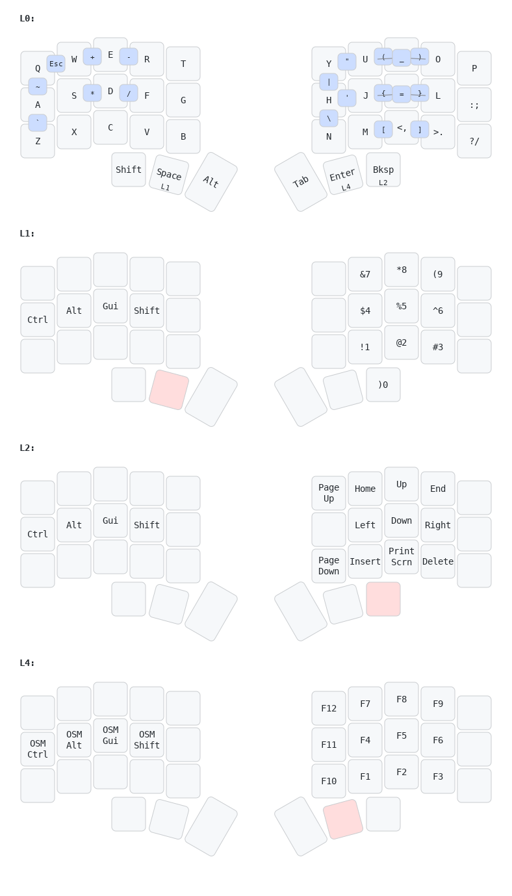
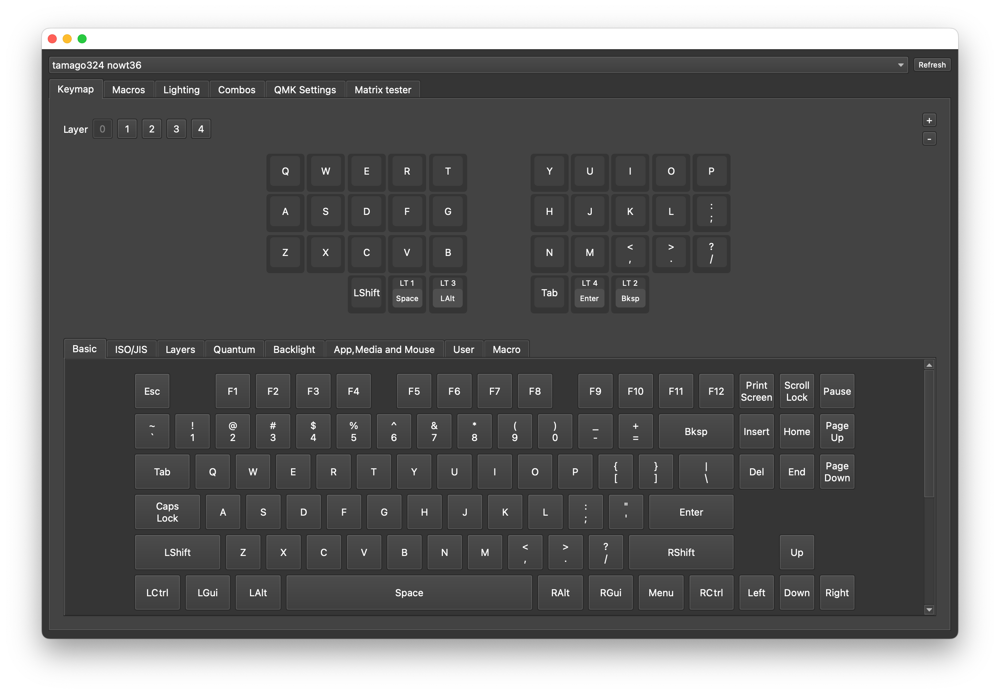

# My nowt36

- Vial support for nowt36
- 32 combos
- 5 layouts

# Prerequisites
- Installed [QMK Toolbox](https://github.com/qmk/qmk_toolbox)

# Usage
1. Fork `vial-qmk`
2. Copy & paste `vial-qmk` in this repo to the fork
3. Build firmware by executing `make tamago324/nowt36:vial`
4. Flash firmware by executing `qmk flash -kb tamago324/nowt36 -km vial`
5. Short the `reset` button on keyboard
6. Open Vial and load `nowt36.vil` layout

# Credits
- [QMK](https://github.com/qmk)
- [Vial](https://github.com/vial-kb)
- [tamago324](https://github.com/tamago324)
- [caksoylar](https://github.com/caksoylar)/[keymap-drawer](https://github.com/caksoylar/keymap-drawer)